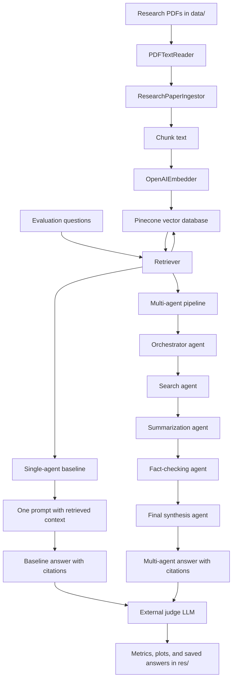

# Multi-Agent Research Assistant

## Project Overview

This project implements a retrieval-augmented research assistant for answering questions about research papers. The main research question is whether a multi-agent system with specialized LLM roles can improve research-answer quality compared with a single-agent baseline.

The project topic is:

> A multi-agent research assistant where specialized LLM agents for search, summarization, and fact-checking collaborate under an orchestrator, benchmarked against a single-agent baseline to evaluate the impact of agent specialization on research quality and accuracy.

The system ingests research-paper PDFs from the `data/` folder, chunks the extracted text, embeds the chunks with OpenAI embeddings, stores them in a Pinecone vector database, retrieves relevant chunks for each question, and compares two answer-generation approaches:

1. **Single-agent baseline:** retrieve top-k chunks and pass all context into one LLM prompt.
2. **Multi-agent system:** use separate agents for planning, search, summarization, fact-checking, and final synthesis.

## High-Level Architecture



## Core Components

### LLM Client

The LLM client is a minimal OpenAI Responses API wrapper. It sends a prompt to a configured OpenAI model and returns both generated text and token usage. Token usage is important because one goal of the project is not only to compare answer quality, but also to compare cost and efficiency.

### PDF Reader and Ingestor

The file reader extracts text from research-paper PDFs. The ingestor reads papers from `data/`, chunks the text, embeds each chunk, and inserts the chunks into Pinecone. Chunking and embedding are treated as one atomic process at the file level: a file is marked as completed only after all chunks have been embedded and indexed.

The ingestor also uses a simple local cache:

- `data/.ingestion_manifest.json` tracks which files have already been fully processed.
- `data/.embedding_cache/` stores chunk-level embedding results.

This makes repeated experiment runs much faster because already indexed papers do not need to be re-embedded.

### Vector Database

Pinecone is used as the vector store. Each chunk is stored with:

- embedding vector
- chunk text
- source file
- chunk id
- metadata needed for citation and retrieval analysis

Pinecone is useful here because research-paper QA depends on finding semantically relevant evidence, not just exact keyword matches.

### Retriever

The retriever embeds a user query and asks Pinecone for the top-k most similar chunks. These retrieved chunks become the evidence base for both the baseline and the multi-agent system.

## What "Specialized Agents" Means

In this project, a specialized agent does not necessarily mean a completely separate trained model. It means an LLM call assigned to a specific task, with a role-specific prompt and a role-specific responsibility.

The specialized agents are:

- **Orchestrator agent:** classifies the query, decides whether it is simple, comparative, methodological, or multi-part, and creates a retrieval plan.
- **Search agent:** generates search queries and retrieves evidence chunks from the paper corpus.
- **Summarization agent:** turns retrieved chunks into concise evidence notes, including key claims, numbers, and supporting statements.
- **Fact-checking agent:** inspects the draft answer claim by claim and marks claims as supported, weakly supported, or unsupported.
- **Final synthesis agent:** writes the final answer with citations and uncertainty when evidence is incomplete or conflicting.

This matters because research QA is not a single task. It requires retrieval, evidence compression, reasoning, citation discipline, and verification. A single prompt has to do all of these at once. The multi-agent design tests whether breaking the work into specialized steps improves factual accuracy, completeness, and citation quality.

## RAG Design

The project uses Retrieval-Augmented Generation because research papers are too long to fit reliably into a single prompt, and answers should be grounded in paper evidence rather than model memory.

RAG is used for three reasons:

1. **Grounding:** answers should be based on the paper text, not general knowledge.
2. **Citation:** retrieved chunks provide source references for citations.
3. **Scalability:** the system can index multiple papers and retrieve only the most relevant chunks for each question.

The baseline and multi-agent system both use the same retriever and vector database. This makes the comparison fairer because both systems receive evidence from the same underlying corpus.

## Dataset Selection

The dataset is the set of research-paper PDFs placed in the `data/` folder. The current evaluation is centered on the paper `2002.08909v1.pdf`, the REALM paper, because it is a good fit for this project:

- It discusses retrieval-augmented language modeling.
- It includes mechanisms, comparisons, experiments, and limitations.
- It supports both easy lookup questions and deeper synthesis questions.
- It gives the benchmark enough complexity to test whether multi-agent specialization helps.

The evaluation question set includes these categories:

- easy lookup questions
- definition questions
- method and mechanism questions
- comparison questions
- evidence synthesis questions
- multi-step reasoning questions
- limitation and uncertainty questions
- citation grounding questions

Using multiple question types is important because a multi-agent system may not help equally on every task. It may be unnecessary for easy lookup questions but useful for synthesis, comparison, and uncertainty-heavy questions.

## Baseline System

The baseline is intentionally simple:

1. Retrieve the top-k chunks for a question.
2. Put all retrieved context into one LLM prompt.
3. Ask the LLM to answer with citations.

This baseline represents a standard single-agent RAG assistant. It is the main point of comparison for evaluating whether agent specialization adds value.

## Multi-Agent System

The multi-agent system uses the same retrieved corpus but divides the reasoning process into stages:

1. **Planning:** classify the question and identify subquestions if needed.
2. **Search:** generate retrieval queries and collect candidate evidence.
3. **Evidence selection:** cap the evidence passed to summarization at the experiment's `top_k`.
4. **Summarization:** create evidence notes from selected chunks.
5. **Draft synthesis:** write an initial answer from the notes.
6. **Fact-checking:** inspect each factual claim and classify support level.
7. **Final synthesis:** revise the answer with stricter citation discipline and uncertainty.

The final answer is instructed to cite factual sentences directly, for example:

> REALM uses a learned textual retriever to retrieve documents before prediction [E2].

This avoids vague citation dumps such as:

> REALM uses retrieval and improves QA [E2][E5].

## Design Decisions

### Controlled Variables

The experiment design changes one major variable at a time where possible. This is important because earlier experiments mixed model choice and retrieval depth, which made results harder to interpret.

The current design controls:

- **Architecture:** single-agent baseline vs multi-agent pipeline with the same model and same `top_k`.
- **Model allocation:** keep `top_k=5` fixed and change which subagent uses a stronger model.
- **Retrieval depth:** keep model allocation fixed and vary `top_k`.

This makes it easier to answer questions such as:

- Does agent specialization help when the model and retrieved evidence budget are held constant?
- Which subagent benefits most from a stronger model?
- Does increasing `top_k` help, or does it introduce noisy evidence?

### Specialized Model Allocation

The project also tests smaller and larger models for different subagents. A "specialized model" in this context means a model assigned to a specific role in the multi-agent pipeline. It can be the same base model as the other agents, or a stronger model used only for a high-impact role.

This matters because using a larger model for every step is expensive. A useful multi-agent system should ideally show where stronger models are worth the cost. For example, it may be better to use a larger model only for fact-checking and final synthesis rather than for search and orchestration.

### Evidence Capping

The multi-agent system caps evidence passed into summarization at the experiment's `top_k`. This keeps the evidence budget controlled. If `top_k=5`, the summarizer sees at most five evidence chunks. This avoids comparing systems where one condition silently receives much more context than another.

### External Judge

An external judge LLM scores both baseline and multi-agent answers. It evaluates:

- factual accuracy: 1-5
- completeness: 1-5
- citation quality: 1-5
- clarity: 1-5
- unsupported claims: count

The judge is given the question, answer, and retrieved evidence. It is instructed to judge only against the provided evidence.

## Experiment Design

The experiments are grouped into three main families.

### 1. Architecture Control

This experiment holds model choice and `top_k` constant.

| Experiment | Variable Tested | Model Setup | top_k |
|---|---|---|---:|
| experiment01_architecture_control_top5 | architecture | all small models | 5 |

This is the cleanest test of whether the multi-agent architecture helps compared with the single-agent baseline.

### 2. Model Allocation Ablations

These experiments keep `top_k=5` fixed and change which subagent uses the stronger model.

| Experiment | Variable Tested | Strong Model Assigned To | top_k |
|---|---|---|---:|
| experiment02_strong_orchestrator_top5 | model allocation | orchestrator | 5 |
| experiment03_strong_search_top5 | model allocation | search | 5 |
| experiment04_strong_summarizer_top5 | model allocation | summarization | 5 |
| experiment05_strong_fact_checker_top5 | model allocation | fact-checking | 5 |
| experiment06_strong_synthesizer_top5 | model allocation | final synthesis | 5 |
| experiment07_strong_checker_synth_top5 | model interaction | fact-checking and final synthesis | 5 |
| experiment08_all_strong_top5 | upper bound | all agents | 5 |

These experiments test whether some agent roles benefit more from stronger models than others.

### 3. Retrieval Depth Sweep

These experiments vary `top_k` while keeping model allocation fixed. The `top_k=5` model-allocation experiments serve as the middle anchor, while additional experiments test `top_k=3` and `top_k=8`.

| Model Setup | top_k Values |
|---|---|
| all small models | 3, 5, 8 |
| strong orchestrator only | 3, 5, 8 |
| strong search only | 3, 5, 8 |
| strong summarizer only | 3, 5, 8 |
| strong fact checker only | 3, 5, 8 |
| strong final synthesizer only | 3, 5, 8 |
| strong fact checker and final synthesizer | 3, 5, 8 |
| all strong models | 3, 5, 8 |

This tests whether more retrieved evidence improves answer quality or creates distraction.

## Metrics

The project records:

- latency for baseline and multi-agent answers
- token usage for baseline and multi-agent answers
- number of baseline citations
- number of multi-agent evidence chunks
- fact-check status counts
- judge scores for factual accuracy, completeness, citation quality, and clarity
- judge-estimated unsupported claim counts

Each experiment saves:

- `answers.md`
- `metrics.json`
- latency plots
- token usage plots
- citation and evidence plots
- fact-check status plots
- judge score plots

The cross-experiment summary is generated in:

```text
res/summary/
```

## Runtime and Reproducibility

The experiment runner embeds and indexes documents before running experiments. If documents have already been processed, ingestion is skipped using the local manifest and embedding cache.

Experiments are saved with deterministic folder names such as:

```text
res/experiment01_architecture_control_top5/
res/experiment07_strong_checker_synth_top5/
res/experiment24_strong_synthesizer_top8/
```

This means rerunning the project overwrites prior results for the same experiment names.

To reduce runtime, the runner uses bounded parallelism:

- `QUESTION_CONCURRENCY` controls how many questions run in parallel within an experiment.
- `JUDGE_CONCURRENCY` controls how many judge calls run in parallel.

Experiments themselves remain sequential so that results are easier to interpret and result writing stays deterministic.

## How To Run

With the `data/` folder populated and `.env` configured:

```bash
./run.sh
```

To run only a subset of experiments:

```bash
EXPERIMENT_SLUGS=experiment01_architecture_control_top5,experiment07_strong_checker_synth_top5 ./run.sh
```

## Findings

This section should be completed after running the full experiment suite and reading `res/summary/summary.md`.

### Overall Results

| Experiment Family | Main Observation | Evidence From Metrics |
|---|---|---|
| Architecture control | TODO | TODO |
| Model allocation ablations | TODO | TODO |
| Retrieval depth sweep | TODO | TODO |

### Baseline vs Multi-Agent

TODO: Summarize whether the multi-agent system improves factual accuracy, completeness, citation quality, or clarity compared with the baseline when model and `top_k` are controlled.

### Which Specialized Agent Benefits Most From A Stronger Model?

TODO: Compare the model-allocation ablations. Note whether the stronger orchestrator, search agent, summarizer, fact checker, final synthesizer, checker+synthesizer pair, or all-strong setup performs best.

### Effect Of Retrieval Depth

TODO: Compare `top_k=3`, `top_k=5`, and `top_k=8`. Note whether more evidence improves synthesis questions or increases unsupported claims due to noisy context.

### Citation Quality

TODO: Report whether the multi-agent system produces more precise sentence-level citations than the baseline. Use judge citation-quality scores and manual examples from `answers.md`.

### Unsupported Claims

TODO: Report whether stricter fact-checking reduces unsupported claims. Include both internal fact-check status counts and external judge unsupported-claim counts.

### Cost and Latency

TODO: Compare token usage and latency. Multi-agent systems are expected to cost more and take longer because they make multiple LLM calls. The key question is whether quality improvements justify the added cost.

## Threats To Validity

- The current dataset is small and centered on a limited set of research-paper PDFs.
- The external judge is itself an LLM, so judge scores should be treated as approximate rather than absolute ground truth.
- Parallel execution can make latency measurements noisier because multiple API calls may compete for network and provider resources.
- Retrieval quality depends on chunking, embedding model choice, and the indexed text extracted from PDFs.
- PDF text extraction may miss information from figures, tables, equations, or images.
- The multi-agent system may be more sensitive to prompt design than the baseline.

## Conclusion

This project evaluates whether agent specialization improves retrieval-augmented research QA. The system compares a single-agent RAG baseline against a multi-agent pipeline with dedicated search, summarization, fact-checking, and synthesis roles. The controlled experiment design separates architecture effects, model-allocation effects, and retrieval-depth effects.

The expected tradeoff is that the multi-agent system will use more tokens and have higher latency, but may improve citation quality, factual accuracy, and handling of complex synthesis questions. The final conclusion should be filled in after reviewing the generated results in `res/summary/`.

Final conclusion after experiments:

TODO: State whether the multi-agent system meaningfully improves research quality and accuracy, under which configurations it helps most, and whether the added cost is justified.
